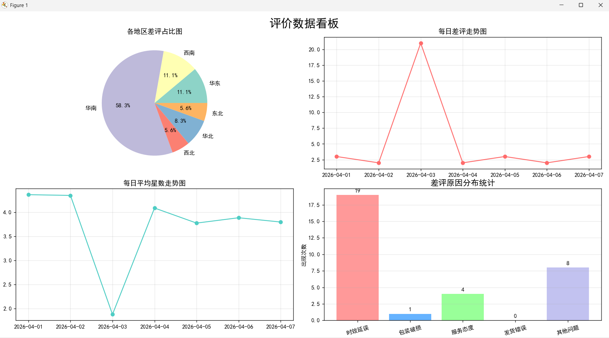

# 物流评价数据管理分析系统

这是一个用于练习数据工程与数据分析的项目，主要目的是分析物流评价中的差评，内容包括数据清洗入库，统计值计算，占比与趋势可视化，以及使用大模型API对差评文本进行类别分析与可视化。

项目结构：

```
DATATRAINING/
├── README.md           # 项目说明
├── data.csv            # 自造原始数据
├── init.py             # MySQL建库
├── update.py           # 清洗数据并入库
├── llm.py              # 调用大模型API，记录类别位掩码
├── analysis.py         # 计算统计值
└── demo.py             # 运行可视化
```

运行结果截图：


